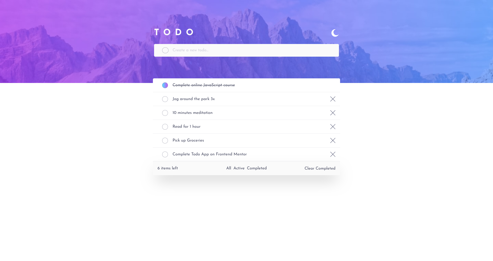

# Frontend Mentor - Todo app solution

This is a solution to the [Todo app challenge on Frontend Mentor](https://www.frontendmentor.io/challenges/todo-app-Su1_KokOW). Frontend Mentor challenges help you improve your coding skills by building realistic projects.

## Table of contents

- [Overview](#overview)
  - [The challenge](#the-challenge)
  - [Screenshot](#screenshot)
  - [Links](#links)
- [My process](#my-process)
  - [Built with](#built-with)
  - [What I learned](#what-i-learned)
  - [Continued development](#continued-development)
  - [Useful resources](#useful-resources)
- [Author](#author)


## Overview

### The challenge

Users should be able to:

- View the optimal layout for the app depending on their device's screen size
- See hover states for all interactive elements on the page
- Add new todos to the list
- Mark todos as complete
- Delete todos from the list
- Filter by all/active/complete todos
- Clear all completed todos
- Toggle light and dark mode
- **Bonus**: Drag and drop to reorder items on the list

### Screenshot



### Links

- Solution URL: [Solution](https://github.com/cvalencia1991/Typescript-React)
- Live Site URL: [live site here](https://todolistreactypescript.netlify.app/)


## My process

### Built with

- Semantic HTML5 markup
- CSS custom properties
- Flexbox
- CSS Grid
- Mobile-first workflow
- [React](https://reactjs.org/) - JS library
- [Tailwind](https://tailwindcss.com/) - For styles


### What I learned

This line of code give me the idea on how implement LocalStorage to save the information in the browser

```React
    const [tasks, setTasks] = useState<ITask[]>(()=>{
        const localTasks = localStorage.getItem("tasks");
        return localTasks ? JSON.parse(localTasks) : [];
    });
```

### Continued development

- Implement diferents frameworks to work with
- Update the states using Redux


### Useful resources

- [Example resource 1](https://www.youtube.com/watch?v=_8FTL-xNz9Q) - This help me to improve and use the theme depending of the OS.
- [Example resource 2](https://www.udemy.com/course/understanding-typescript/) -This Course help me to understand More better Typescript and the syntaxis

## Author

- Website - [Cesar Valencia](https://cvalencia1991.github.io/Portfolio/)
- Frontend Mentor - [@cesarvalencia](https://www.frontendmentor.io/profile/cvalencia1991)
- X - [@cvalenciaaguilar](https://twitter.com/cvalenciaguilar)
